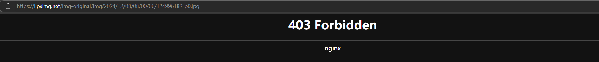

参考的项目：
https://github.com/fatedier/frp
https://github.com/XunM0/pixiv-
https://github.com/CWHer/PixivCrawler
https://github.com/IrisRainbowNeko/pixiv_AI_crawler

# Pixiv插画作品的流行趋势分析·1

本项目主要目的为爬取Pixiv的排行榜的图片相关信息
(例如点赞、收藏、浏览量)

同时添加了自定义 评分 = 0.3\*点赞量+0.5\*收藏量+0.2\*浏览量

需要添加代理
## 项目框架
    pixiv-
    ├── flask2
    │   ├── app.py web框架
    │   ├── DAO.py 数据库交互层
    │   ├── reptile.py 爬虫
    │   ├── dataSql.DB 数据库存储爬取的信息
    │   ├── static 存储html静态资源
    │   └── templates 存储html模板
    ├── config  配置文件COOkie和UA模拟浏览器登录，和数据库地址
    ├── output 存储爬取的图片
    ├── README.md 项目说明
    └── requirements.txt 项目依赖，自动创建虚拟环境


## 项目使用到的工具

- SQLite 数据库存储数据也可以用Excel
- lxml 解析html网页
- pandas 数据
- requests 网络
- selenium 模拟浏览器
- pyecharts 数据可视化绘图
- flask web框架
- Jinja2 模板引擎用于生成网页
- tqdm 过程可视化 
- 
## 运行环境

- python3.9
- windows11
- 

## 遇到的问题
 爬虫相关：初步使用selenium爬取，但发现无法使用cookie登录成功  
 后改用selenium+requests+cookie的方式，先用自动化爬取  
 要下载的具有反爬虫的图片链接，并在此阶段收集网站图片的信息：标签作者浏览量等  
 然后在用request的过程中，遇到更多问题，  
 首先，因为是国外网站，要配置代理，但是发现直接使用这样的代码，是有问题的，会出现proxyERROR，原因不明
 ```python
proxy = {
    "http": "http://127.0.0.1:7890",
    "https": "https://127.0.0.1:7890"
}
```
解决办法是需要将代理设置成字典的形式，如下：
```python
@dataclasses.dataclass  # 使用 dataclass 装饰器
class ProxyConfig:
    proxy: Dict = dataclasses.field(default_factory=lambda: {"https": "http://127.0.0.1:7890"})

# 初始化代理配置
proxy_config = ProxyConfig()
```
很抽象 
还要使用re正则匹配实现从网页链接里匹配需要的部分，
因为通过逆向发现原始的图片链接如下 https://i.pximg.net/img-original/img/2024/12/08/08/00/06/124996182_p0.jpg
具有反爬虫规则，不登录，或者不点击大图获取不到…… 
所以需要配置header ，模拟浏览器登录，如下：
```python
headers = {
    "Cookie": Cookie ,
    "User-Agent": 模拟浏览器
} 
```
还有更抽象的地方 ：referer
Referer 是 HTTP 请求头的一部分，用于告知服务器当前请求来源的页面
pixiv机制下从错误的网站跳转过了就会出现403error(由于一直走弯路，见了几百遍403)
如图
P站的反爬机制：
大量失败实践发现，关键只有两点：cookie和referer（防盗链保护）。

这个点需要在header里设置referer，但不能直接设置，
需要获取作品的展示网站，从那里跳转，一般是类似于
https://www.pixiv.net/artworks/124996182  这样的网站，
但很巧，我的方法在selenium自动化控制阶段，刚好就是在这些网站上进行爬取的
，通过正则获取的id,在直接拼接就行
```python
referer=f'https://www.pixiv.net/artworks/{作品id}'
```
不这么设置403Forbidden是必然的，坐牢是必然的，警钟长鸣  
然后就简单了，突破了反爬机制
直接 response = requests.get 获取图片，保存到本地即可
还有小细节，请求完time.sleep()一下，不然由于请求频繁，服务器会强制关闭连接。
ConnectionResetError 别问我怎么知道的
```ai的解释
1. 什么是 Referer？
Referer 是 HTTP 请求头的一部分，用于告知服务器当前请求来源的页面 URL。例如：

如果你从 https://www.pixiv.net/artworks/12345678 页面发起图片请求，服务器会收到的 Referer 是该页面的地址。
2. 为什么 Pixiv 要检查 Referer？
Pixiv 使用 Referer 检查来防止未经授权的访问（防盗链），主要有以下目的：

保护图片资源：避免第三方网站直接引用 Pixiv 的图片资源，消耗服务器流量。
验证合法性：确保请求来源是来自 Pixiv 自己的网站或官方应用。
提升用户体验：通过防盗链限制，Pixiv 可以强制用户访问其页面而不是直接获取资源。
如果不设置 Referer 或者 Referer 不符合 Pixiv 的要求，服务器会返回 403 Forbidden 错误，拒绝图片的下载。

3. 为什么 Referer 设置为 https://www.pixiv.net/artworks/{image_id}？
Pixiv 的 Referer 验证机制：

当你浏览 Pixiv 的插画页面时（例如 https://www.pixiv.net/artworks/12345678），页面中的图片资源会从 Pixiv 的 CDN 加载。Pixiv 服务器会验证图片请求的 Referer 是否指向插画详情页面或其他合法来源。
合法的 Referer 格式通常类似于：https://www.pixiv.net/artworks/{image_id}。
伪装为正常用户行为：

爬虫发起图片请求时，设置 Referer 为插画详情页的地址（https://www.pixiv.net/artworks/{image_id}），可以让服务器认为这是正常的浏览器行为，避免返回 403 错误。
```


常见的简单反爬突破方法
通过User-Agent来控制访问
IP代理池
模拟浏览器行为
等等


## 更多问题
在模拟浏览器过程中，从页面中获取信息  
巨麻烦，现在也不怎么会，由于pixiv是动态加载，html内容会发生变化，
所以需要人工确认所需信息的css选择器或XPath地址，
然后通过selenium的find_element()方法获取信息（我用的主要方法）
比如在爬作者信息是用的 一眼看上去莫名其妙的乱码类名，头大
```python
writer = browser.find_element(By.CLASS_NAME,'fATptn').find_element(By.TAG_NAME,'div').text
```

## 更多想法
如果只是收集信息，使用request+beautiful会不会更快
解析过的html再用正则匹配找到想要的信息会不会更快？

pandas 的 to_sql() 方法用于将 DataFrame 中的数据插入到数据库表中。
这个方法需要两个参数：表名和数据库连接对象。

由于爬取信息是50份，但我下载图片只要前10份也就是中间就收集够了，
能不能用异步在收集够了之后，直接执行和爬取信息一块进行？
download.download_images(download_list)
方法可以有 
- 多线程
- 异步

